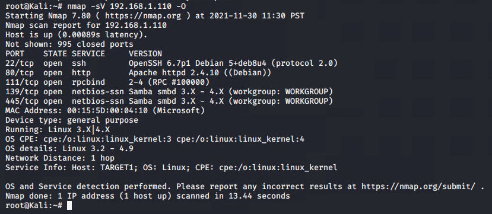
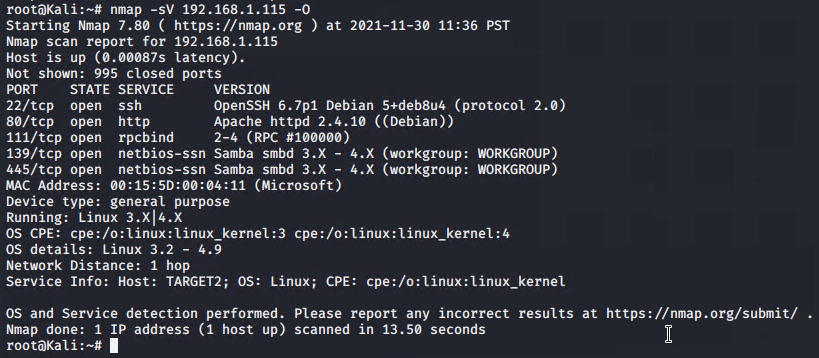
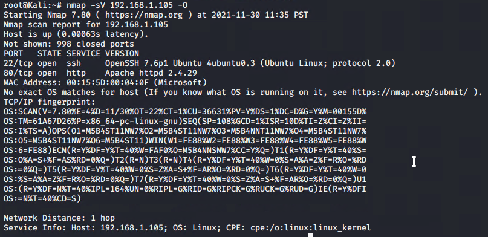
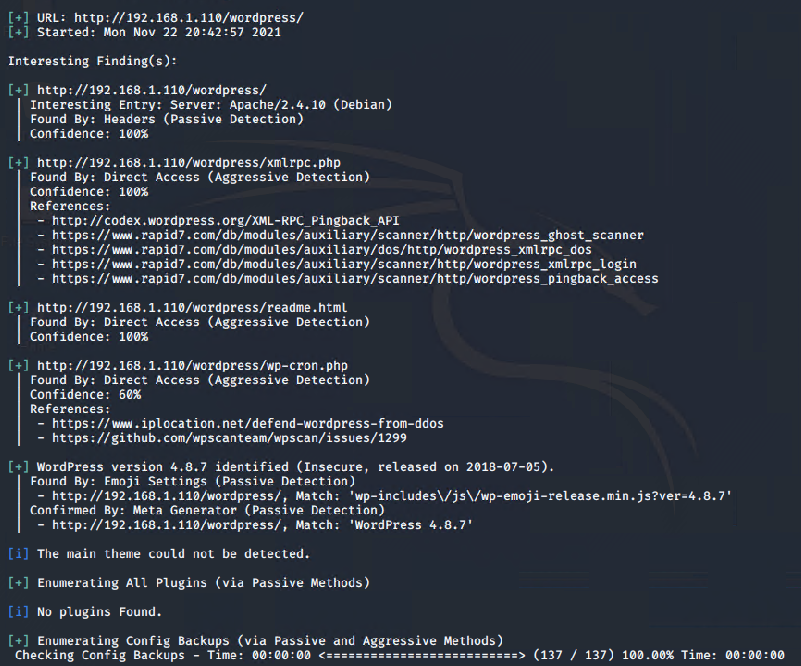
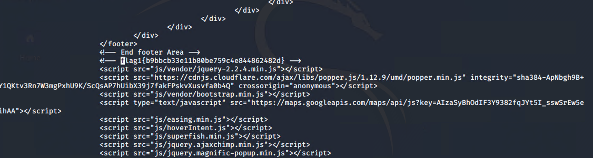
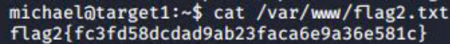

# Red Team: Summary of Operations

## Table of Contents
- Exposed Services
- Critical Vulnerabilities
- Exploitation

### Exposed Services
Nmap scan results for each machine reveal the below services and OS details:

Target 1

Target 2

Capstone

This scan identifies the services below as potential points of entry:

- Target 1
  - SSH
  - HTTP
  - rpcbind
  - netbios-ssn on port 139 & 445

The following vulnerabilities were identified on each target:
- Target 1
  - WordPress XML rpc pingnack
  - WordPress XMLRPC GHOST Vulnerability Scanner
    - CVE-2015-0235
  - WordPress XMLRPC DoS
    - CVE-2014-5266
  - WordPress XMLRPC username and Password login scanner
    - CVE-1999-0502
  - WordPress PingBack Locator
    - CVE-2013-0235
  - Cron Wordpress Attacks
  - WordPress version 4.8.7 Vulnerability

### Exploitation
The Red Team was able to penetrate `Target 1` and retrieve the following confidential data:
- Target 1
  - flag1:b9bbcb33e11b80be759c4e844862482d
    - **Exploit Used**
      - Open Port 22 
        - ssh michael@192.168.1.110
        - 
  
  
  
  - flag2:fc3fd58dcdad9ab23faca6e9a36e581c
  
    - **Exploit Used**
      
      - file exploration once we where inside the machine via ssh 
      - cat /var/www/flag2.txt
      - 
      
      